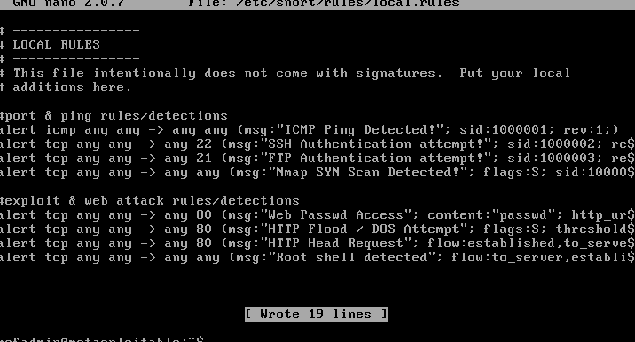

# HIDS-MS2-lab
A HIDS lab using Snort to detect and alert on penetration testing exploits against Metasploitable 2.

## Overview:
This HIDS project was built in a virtualised environment to monitor host traffic and it serves as a demonstration of a Host based IDS as it configures snort on MS2, a vulnerable target to capture exploitation detections and alerts. Multiple tests were executed including port active reconnaissance and backdoor shell triggers. Deep packet visibility was provided to capture where failure of port blocking and exploits occurs.

## Technical stack:
**Tools**: Nmap, Snort, Netcat

**Environment**: Metasploitable 2 (Host based system & Target), Kali Linux (Attacker & Adversarial system)

**Interfaces** / *Frameworks & Clients*: Metasploit framework, SMBclient, VNC viewer

## System Architecture:
In this HIDS lab, Snort was deployed as a host-based sensor running directly on the vulnerable target, Metasploitable 2. This configuration allowed Snort to monitor all incoming network traffic, active exploits, and interactive commands sent to the host. The engine successfully detected and flagged post-exploitation alerts and unauthorized attempts to compromise system security.

## Configuration & Rule development:
The main configuration and local rules files were configured to target the local host network and optimized for proper initialization. All custom rules were correctly parsed and positioned before trailing rule modifiers (such as nocase; and flow;) to prevent syntax errors

*Rule Development*: Custom rules were created in local.rules to detect attacks, demonstrating the ability to write custom logic for multiple protocols and track an attack from initial access to post exploitation such as interactive command detection, flagging suspicious command executions (whoami & id). Rules were implemented to flag unauthorized exploitation attempts that target open ports.

Figure 1: Local configured rules.

## Threat detection & Penetration testing:
A multi-stage penetration test was conducted to validate the detection accuracy of the HIDS framework.

*Port Scanning*: An initial port scan was performed on the MS2 machine triggering TCP & UDP port scan rules. 

*HIDS Trigger*: A second aggressive & thorough reconnaissance scan was executed on the MS2 host machine, using nmap -A, triggering ICMP, SYN Scan, & FTP rules. The scan outlined the attack surfaces from the Kali Linux terminal revealing open & vulnerable ports (Port 21 (FTP), Port 22 (SSH), and Port 23 (Telnet)). 

Figure 2: Aggressive Nmap scan results.

*Service Verification*: Following the open ports discovered mapped out on the Kali terminal, manual interactions on ports 22,23 and curl web commands on port 80 were executed,  These interactions successfully tripped the configured protocol rules (curl -I on port 80), capturing the HTTP HEAD request rule.

 

Figure 3: Manual interaction via HTTP, SSH, and Telnet.

*SMB Service Enumeration*: "smbclient" Enumeration tools were initiated manually against the target host generating traffic signatures, capturing unauthorised enumeration attempts

 

Figure 4: Network share enumeration using smbclient.

*Exploitation & Backdoor Authentication*: Upon targeting the open FTP port, 21, a trigger was performed to exploit the "vsftpd 2.3.4" backdoor vulnerability. 

The FTP authentication rule was immediately triggered on the target host as an alert. 

The custom root shell raising a high priority alert on using Netcat. Upon successful trigger of the backdoor configuration of port 21, the "whoami" command was executed from the Kali Linux terminal confirming control of the host system was achieved.
  

 
Figure 5: vsftpd 2.3.4 backdoor exploitation and root command execution.

 *VNC  Exploitation & Remote Access*: Due to a weak VNC password detected by Nessus, a session was successfully initiated on Metasploitable 2 from the attacker machine (Kali)

  

 Figure 6: GUI session established over VNC connection.

## Post Incident Analysis & Conclusion:
Following full penetration testing and custom deployed snort rules detecting a series of targets on the target host, Metasploitable 2, the detection engine proved highly effective.
This defensive framework has ensured precise alerts with a detection rate near 100%, protecting network environments by identifying malicious activity.
 
